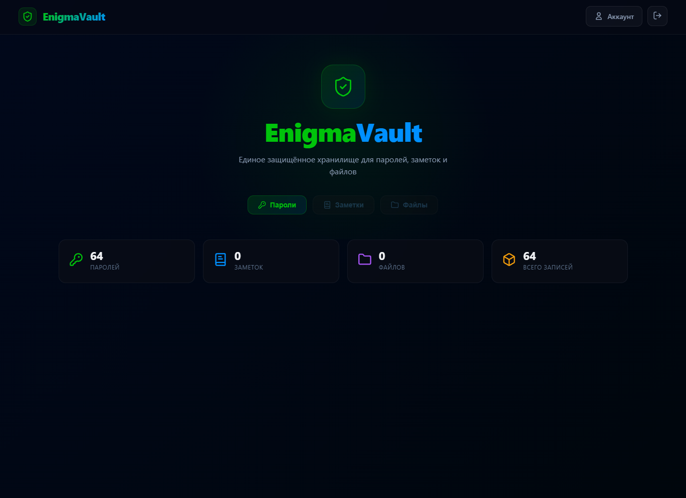
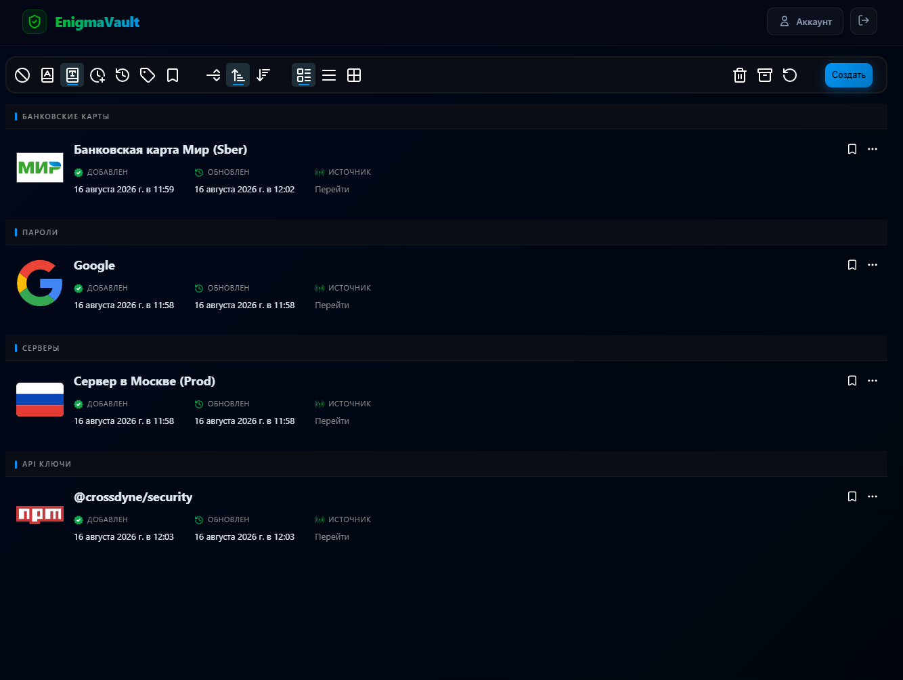
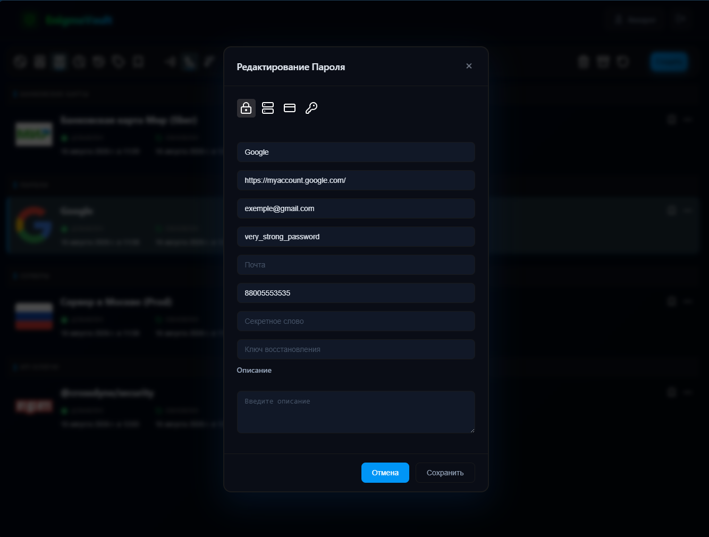
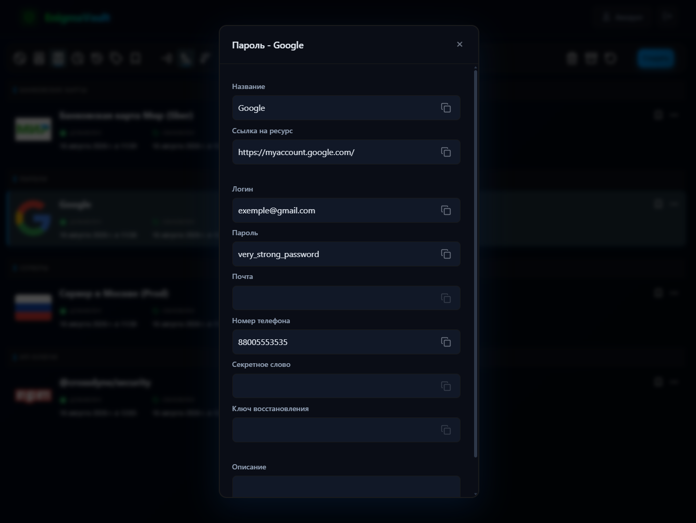

# 🔐 EnigmaVault

> **Единое защищённое хранилище для паролей экосистемы Crossdyne**

EnigmaVault — это централизованный менеджер секретов, обеспечивающий безопасное хранение и управление паролями в рамках экосистемы **Crossdyne**. Платформа интегрирована с SSO-платформой **Nexus** для seamless-аутентификации и использует централизованное хранилище иконок **Glyph**.

---

## Скриншоты

### Десктопная версия — Дашборд
Главная панель с агрегированной статистикой: количество паролей, заметок, файлов и общее число записей. Планируется развитие данной страницы в будущем.

**

### Десктопная версия — Список записей
Удобный список всех секретов с группировкой по категориям (API ключи, Пароли), датами добавления/обновления и быстрыми действиями.

**

### Просмотр и редактирование
Модальные окна для просмотра и редактирования записей с типизированными полями, копированием в буфер обмена и переключением типа секрета.

### Редактирование
**

### Просмотр
**
---

## Возможности

| Функция | Описание |
|---------|----------|
| 🔐 **Хранение паролей** | Безопасное хранение паролей разного формата |
| 🏷️ **Теги и категории** | Гибкая система группировки записей по тегам с цветовой индикацией |
| ⭐ **Избранное** | Быстрый доступ к часто используемым записям через контекстное меню |
| 🗄️ **Архив** | Возможность архивирования устаревших записей без полного удаления |
| 📋 **Копирование в буфер** | One-click копирование паролей, ключей и любых полей записи |
| 🌐 **SSO через Nexus** | Единый вход через кроссдоменную аутентификацию Crossdyne (SRP + BFF) |
| 🎨 **Иконки из Glyph** | Централизованное хранилище SVG-ассетов |
| 🖥️ **Десктопное приложение** | Нативный клиент для десктопа (в дополнение к веб-версии) |
| 📱 **Адаптивный UI** | Корректное отображение на десктопе, планшетах и смартфонах |

---

## Архитектура

### Общая схема

```
┌─────────────────┐     ┌─────────────────┐     ┌─────────────────────────┐
│   Пользователь  │────>│  Nexus (SSO)    │────>│     EnigmaVault         │
│                 │     │  crossdyne.com  │     │  vault.crossdyne.com    │
└─────────────────┘     └─────────────────┘     └───────────┬─────────────┘
                                                            │
                              ┌─────────────────────────────┴─────────────────────────────┐
                              │              Backend for Frontend                         │
                              │           (EnigmaVault.Web.Bff)                           │
                              │  • Агрегация запросов от UI                               │
                              │  • Проксирование к микросервисам Password, Nexus, Glyph   │
                              │  • Кроссдоменные cookies (Nexus SSO)                      │
                              └─────────────────────────────┬─────────────────────────────┘
                                                            │
                    ┌───────────────────────────────────────┼───────────────────────────────────────┐
                    │                                       │                                       │
           ┌────────▼────────────┐              ┌───────────▼────────────┐              ┌───────────▼────────────┐
           │  Password Service   │              │    File Service        │              │   Assets Service       │
           │      (пароли)       │              │  (хранение файлов)     │              │  (Glyph — централизо-  │
           │                     │              │                        │              │   ванные иконки)       │
           └─────────────────────┘              └────────────────────────┘              └────────────────────────┘
```

### Компоненты Backend

| Сервис | Назначение |
|--------|-----------|
| `EnigmaVault.Web.Bff` | Backend for Frontend — единая точка входа для frontend, агрегация API, проксирование |
| `EnigmaVault.Password.Service` | Управление паролями, заметками и API-ключами (Clean Architecture: Domain, Application, Infrastructure, Api) |
| `EnigmaVault.Authentication.Client` | Клиент для взаимодействия с сервисом аутентификации Nexus (SRP) |
| `EnigmaVault.FileService.Client` | Клиент для взаимодействия с файловым хранилищем |
| `EnigmaVault.AssetsService.Client` | Клиент для получения иконок и ассетов из Glyph |

### Компоненты Frontend

- **Angular** — фреймворк для построения SPA
- **Тёмная тема**
- **Адаптивная вёрстка** — корректное отображение на любых устройствах

---

## Безопасность

### Аутентификация через Nexus
- **Кроссдоменная SSO** — авторизация через единую учётную запись Crossdyne.
- **SameSite=None; Secure** cookies для распространения сессии между поддоменами `*.crossdyne.com`
- **BFF Pattern** — токены и сессионные данные управляются на стороне сервера, не хранятся в браузере

### Хранение секретов
- Все чувствительные данные изолируются между пользователями на уровне сервиса
- Поддержка полного сброса хранилища с потерей зашифрованных данных при сбросе пароля (аналогично Nexus)
- Доступ к записям только после валидной SSO-сессии

---

## Структура проекта

```
enigma-vault/
├── 📂 .github/                    # CI/CD конфигурации
├── 📂 deployment/                 # Docker compose: build и deployment
│
├── 📂 dotnet/                     # Backend-приложение (.NET)
│   ├── 📂 src/
│   │   ├── 📂 apps/
│   │   │   ├── 📁 EnigmaVault.Desktop/                 # Десктопное приложение
│   │   │   └── 📁 EnigmaVault.Web.Bff/                 # BFF-прокси, точка входа для web
│   │   ├── 📂 clients/
│   │   │   ├── 📁 EnigmaVault.AssetsService.Client/    # Клиент для Glyph
│   │   │   ├── 📁 EnigmaVault.Authentication.Client/   # Клиент для Nexus Auth
│   │   │   ├── 📁 EnigmaVault.FileService.Client/      # Клиент для файлового сервиса
│   │   │   └── 📁 EnigmaVault.PasswordService.Client/  # Клиент для Password Service
│   │   ├── 📂 services/
│   │   │   └── 📂 Password/
│   │   │       ├── 📁 EnigmaVault.Password.Service.Api/            # REST API
│   │   │       ├── 📁 EnigmaVault.Password.Service.Application/    # Бизнес-логика
│   │   │       ├── 📁 EnigmaVault.Password.Service.Domain/         # Доменные модели
│   │   │       └── 📁 EnigmaVault.Password.Service.Infrastructure/ # Доступ к данным
│   │   ├── 📂 shared/             # Общие библиотеки, утилиты, контракты
│   │   └── 📂 tests/              # Интеграционные и модульные тесты
│   ├── 📄 .dockerignore
│   ├── 📄 Directory.Packages.props
│   └── 📄 EnigmaVault.slnx
│
└── 📂 web/                        # Frontend-приложение (Angular)
    └── 📂 enigma-vault-ui/
        ├── 📂 src/                # Исходный код приложения
        ├── 📂 public/             # Статические ресурсы
        ├── 📄 angular.json
        ├── 📄 Dockerfile
        ├── 📄 package.json
        └── 📄 tsconfig.json
```

---

## Технологический стек

### Backend
- **.NET / C#** — основной фреймворк
- **Clean Architecture / DDD** — разделение на Domain, Application, Infrastructure, Api
- **BFF Pattern** — Backend for Frontend
- **Redis** — распределённый кеш
- **Kafka** — event-driven архитектура

### Frontend
- **Angular** — фреймворк UI
- **TypeScript** — типизированный JavaScript
- **SCSS/CSS** — стилизация компонентов

### Инфраструктура
- **Docker** — контейнеризация сервисов
- **Nginx** — reverse proxy
- **Nexus SSO** — единая аутентификация через кроссдоменные cookies
- **Glyph** — централизованное хранилище SVG-ассетов и иконок
- **RustFS** — объектное хранилище для файлов

---

## Roadmap

### Первостепенные задачи

- **Поиск и фильтрация** — глобальный поиск по записям, фильтры по разным полям `Core`
- **История изменений** — аудит изменений записей `Security`
- **Шаринг записей** — безопасный обмен паролями между пользователями экосистемы `Social`
- **Расширение типов** - добавление структуры для хранение строк подключений (прим. строки подключения к БД) `Core`
- **Внедрение статистики на главной странице**
- **Генератор паролей** — встроенный генератор с настройкой сложности и длины `Security`
- **Проверка сложности пароля** — при создание, редактирование, просмотра будет проверяться сложность пароля `Security`

### Без конкретных сроков

- **Автозаполнение браузера** — расширение для Chrome / Firefox `Platform`
- **Мобильное приложение** — нативные приложения для Android (при возможности на IOS) `Platform`
- **Импорт/Экспорт** — поддержка резервного копирование на устройство пользователя. Как в шифрованном формате, так и в открытом `Core`
- **CLI инструмент** — управление секретами через командную строку `Platform`
- **Заметки** - создание, управление заметками. `Core`
- **Файлы** - синхронизация, хранение файлов на с разных устройств. `Core`

---